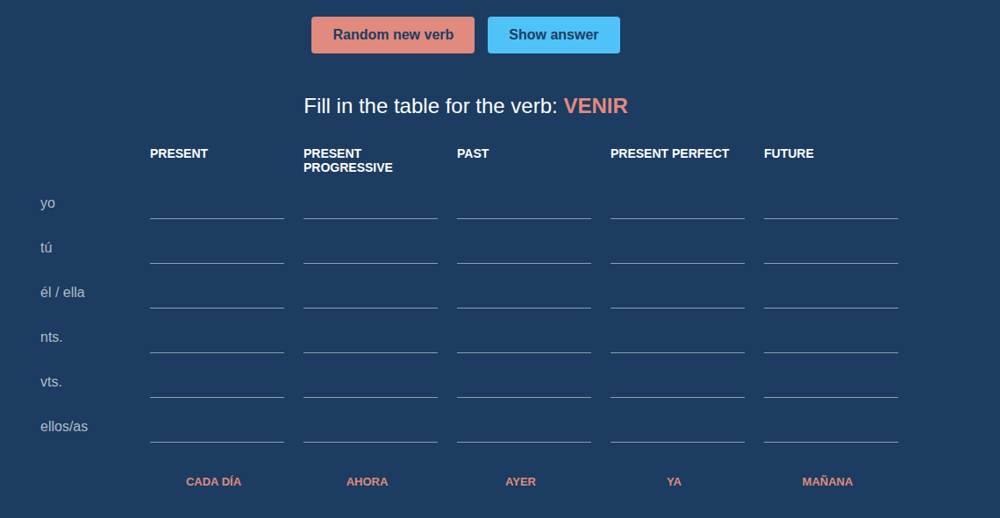
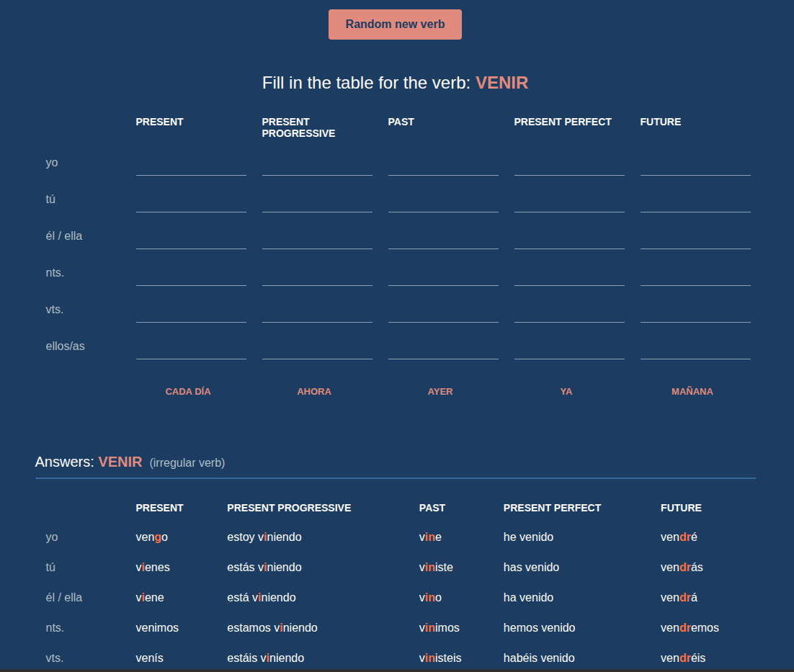
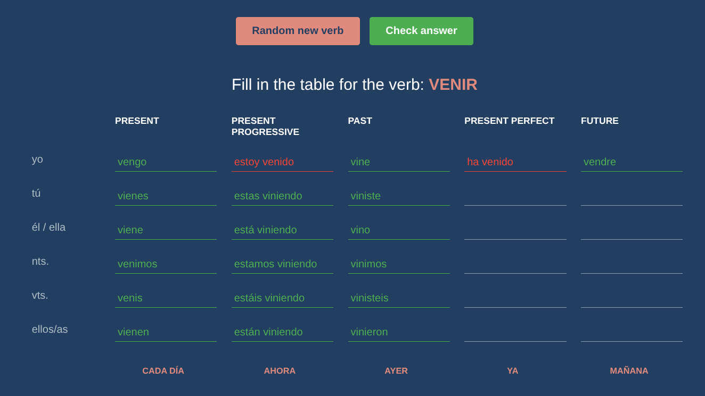

# Spanish Verb Conjugation Practice

A simple, interactive web app to practice Spanish verb conjugations in various tenses.

## Access via link
https://wminotaur.github.io/Spanish_IrrgrlVerbs/

## Screenshots

<table>
  <tr>
    <td align="center"><b>Practice Mode</b></td>
    <td align="center"><b>Answer Mode</b></td>
  </tr>
  <tr>
    <td width="50%">
      
    </td>
    <td width="50%">
      
    </td>
  </tr>
  <tr>
    <td align="center" colspan="2"><b>Answer Button</b></td>
  </tr>
  <tr>
    <td align="center" colspan="2">
      
    </td>
  </tr>
</table>
